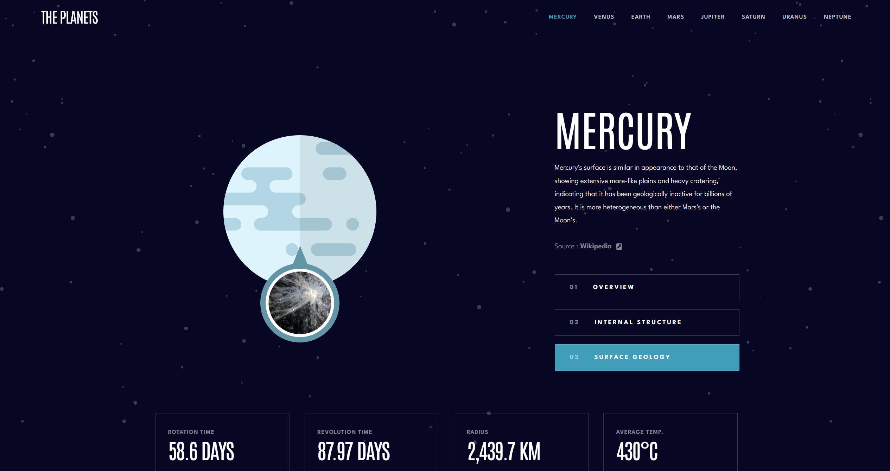

# Frontend Mentor - Planets fact site solution

This is a solution to the [Planets fact site challenge on Frontend Mentor](https://www.frontendmentor.io/challenges/planets-fact-site-gazqN8w_f). Frontend Mentor challenges help you improve your coding skills by building realistic projects.

## Table of contents

- [Overview](#overview)
  - [The challenge](#the-challenge)
  - [Screenshot](#screenshot)
  - [Links](#links)
  - [Features](#features)
- [My process](#my-process)
  - [Built with](#built-with)
  - [What I learned](#what-i-learned)
  - [Continued development](#continued-development)
  - [Useful resources](#useful-resources)
- [Author](#author)
- [Acknowledgments](#acknowledgments)

## Overview

### The challenge

Users should be able to:

- View the optimal layout for the app depending on their device's screen size
- See hover states for all interactive elements on the page
- View each planet page and toggle between "Overview", "Internal Structure", and "Surface Geology"

### Screenshot



### Links

- Solution URL: [Solution](https://your-solution-url.com)
- Live Site URL: [Live Site](https://your-live-site-url.com)

## Features

- **Responsive Design**:  
  Fully optimized for mobile, tablet, and desktop views using TailwindCSS.

- **Dynamic Routing**:  
  Built with React Router v6+, using dynamic route parameters (`:planet`, `:section`) and nested routes with `<Outlet>`.

- **Content from JSON**:  
  All planet data is dynamically loaded from a JSON file, allowing easy updates or additions.

- **Dynamic Image Rendering**:  
  Automatically changes images based on selected sections: Overview, Internal Structure, and Surface Geology.

- **Active Link Highlighting**:  
  Active navigation links are dynamically styled based on the current route using `NavLink`.

- **Reusable Components**:  
  Clean, modular component structure for sections like Actions, Cards, and Main Layout.

- **Error Handling Ready**:  
  Structure set up to easily extend to 404 pages if invalid planet names are accessed.

- **Smooth Navigation**:  
  Navigation between planets and sections is seamless without full page reloads.

## My process

### Built with

- Semantic HTML5 markup
- CSS custom properties
- Flexbox
- Mobile-first workflow
- [React](https://reactjs.org/) - JS library
- [React Router](https://reactrouter.com/) - For routing
- TailwindCSS - For fast and scalable styling
- JSON-based data for dynamic rendering

### What I learned

While working on this project, I learned a lot about React Router's dynamic routes, nested layouts with `<Outlet>`, and capturing multiple URL parameters using `useParams`.  
I also learned how to dynamically render content and images based on JSON data, and how to structure a clean reusable React component system.

Example snippet for capturing dynamic params:

```js
const { planet, section } = useParams();
```

Dynamically loading images based on the section:

```jsx

```

This project helped me better understand dynamic routing, URL structures, and how to organize large-scale front-end applications.

### Continued development

In future projects, I want to continue improving:

- Error handling and user feedback (for example, 404 error pages)
- Performance optimization, such as lazy-loading images
- Adding animations and smooth page transitions (maybe with Framer Motion)
- Improving SEO for React-based apps

### Useful resources

- [React Router Docs](https://reactrouter.com/en/main) – Helped me fully understand nested routing and dynamic params.
- [TailwindCSS Docs](https://tailwindcss.com/docs/installation) – Was very useful for quick styling and responsive designs.
- [Frontend Mentor Community](https://www.frontendmentor.io/community) – Helpful examples and discussions to refer to best practices.

## Author

- Website - [Your Name](https://www.your-site.com)
- Frontend Mentor - [@yourusername](https://www.frontendmentor.io/profile/yourusername)
- Twitter - [@yourusername](https://www.twitter.com/yourusername)

## Acknowledgments

Thanks to the Frontend Mentor community for the constant inspiration and feedback. Also, a big shoutout to React Router's simple yet powerful API which made implementing nested and dynamic routes a great learning experience.
